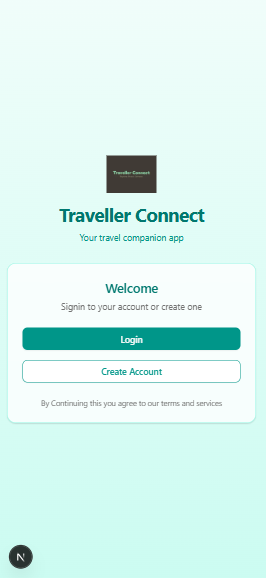
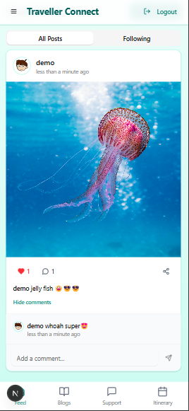
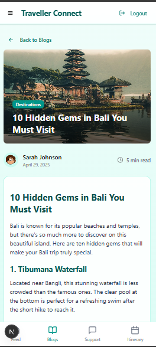
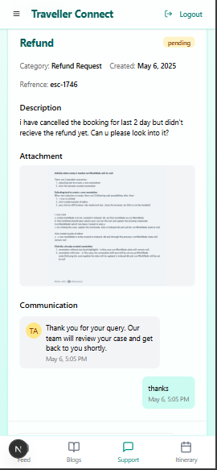
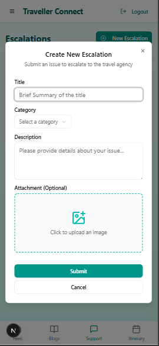
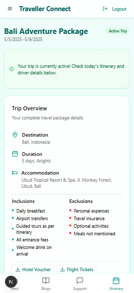

# 🌍 Traveller Connect

**Traveller Connect** is a modern travel companion app built with **Next.js 14**, **React 18**, and **Tailwind CSS**. It helps users share their travel experiences, manage itineraries, read inspiring travel blogs, and raise support tickets – all in one place.

  
  
  
  
  
  

---

## ✨ Features

- 📸 **Travel Feed** – Share photos, stories, and updates from your adventures
- 📝 **Travel Blogs** – Explore and read detailed travel blogs and destination guides
- 🧳 **Itinerary Manager** – Plan and organize trip details day-by-day
- 🛠️ **Support System** – Raise and track support issues while traveling
- 🪙 **Virtual Coin Rewards** – Earn and spend in-app virtual coins

---

## ⚙️ Tech Stack

- **Framework**: Next.js 14 with App Router
- **Styling**: Tailwind CSS v4
- **State Management**: Zustand
- **Authentication**: Lightweight custom localStorage auth (for demo)
- **Notifications**: Sonner for toast messages
- **Markdown Rendering**: ReactMarkdown

---

## 🚀 Getting Started

### 1. Clone the Repository

\`\`\`bash
git clone https://github.com/yourusername/traveller-connect.git
cd traveller-connect
\`\`\`

### 2. Install Dependencies

\`\`\`bash
npm install

# or

yarn install

# or

pnpm install

# or

bun install
\`\`\`

### 3. Run the Development Server

\`\`\`bash
npm run dev

# or

yarn dev

# or

pnpm dev

# or

bun dev
\`\`\`

Visit **[http://localhost:3000](http://localhost:3000)** to view the app in your browser.

---

## 🧪 Demo Credentials

Use the following credentials to explore the app:

\`\`\`
Email: demo@example.com  
Password: password
\`\`\`

Or sign up with any email/password combination.

---

## 🛠 Project Instructions

- 🔧 **Authentication** is mocked with localStorage for demo purposes.
- ✍️ **Blog content** supports Markdown formatting.
- 🧩 **Virtual Coin Logic** is stored client-side.
- 🧾 **Support Tickets** and **Itinerary Data** are stored locally.

---

## 📦 Deployment

Deploy effortlessly using [**Vercel**](https://vercel.com):

\`\`\`bash

# Push to GitHub and import into Vercel

\`\`\`

Or refer to the [Next.js deployment documentation](https://nextjs.org/docs/deployment) for more options.

---

## 📚 Learn More

- [Next.js Documentation](https://nextjs.org/docs)
- [Interactive Next.js Tutorial](https://nextjs.org/learn)
- [Next.js GitHub Repo](https://github.com/vercel/next.js)

---

## 🪪 License

MIT
